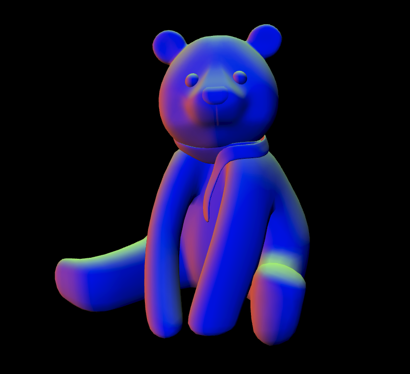

  
  <h1>3D Teddy Bear</h1>
  
  <h3>A rotating 3D Teddy Bear animation</h3>

  <a href="https://3d-teddy-bear.netlify.app/"><h3>Try me!</h3></a>

  
  

## Technologies Used

&nbsp;&nbsp;&nbsp;&nbsp;&nbsp;&nbsp;

&nbsp;&nbsp;&nbsp;&nbsp;&nbsp;&nbsp;

&nbsp;&nbsp;&nbsp;&nbsp;&nbsp;&nbsp;

## Description

## Demo

## To-Do List
- Add lights
- Add camera
- Change camera position according to mouse movement
- Add multiple textures to be chosen randomly on page load

## License

Copyright (c) 2022 Michael Kolesidis 
Licensed under the [GNU General Public License v3.0](https://github.com/michaelkolesidis/webproject-script/blob/main/LICENSE).

 
 

[//]: # (Free Software)

   
   

  

                                                       

  

