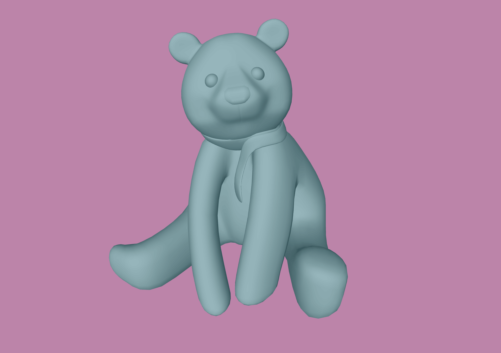
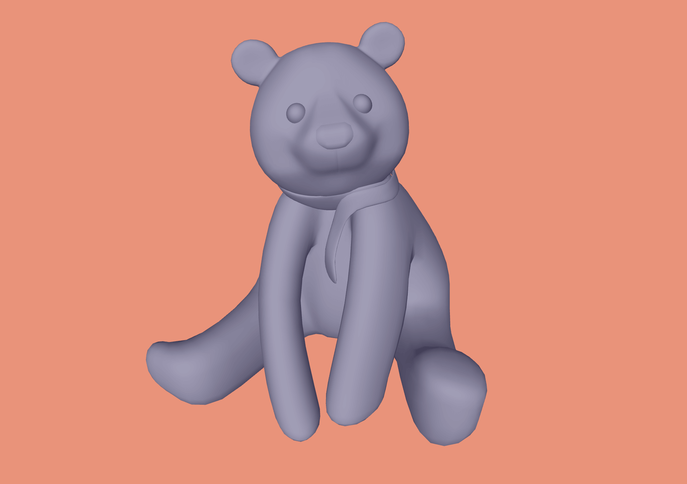
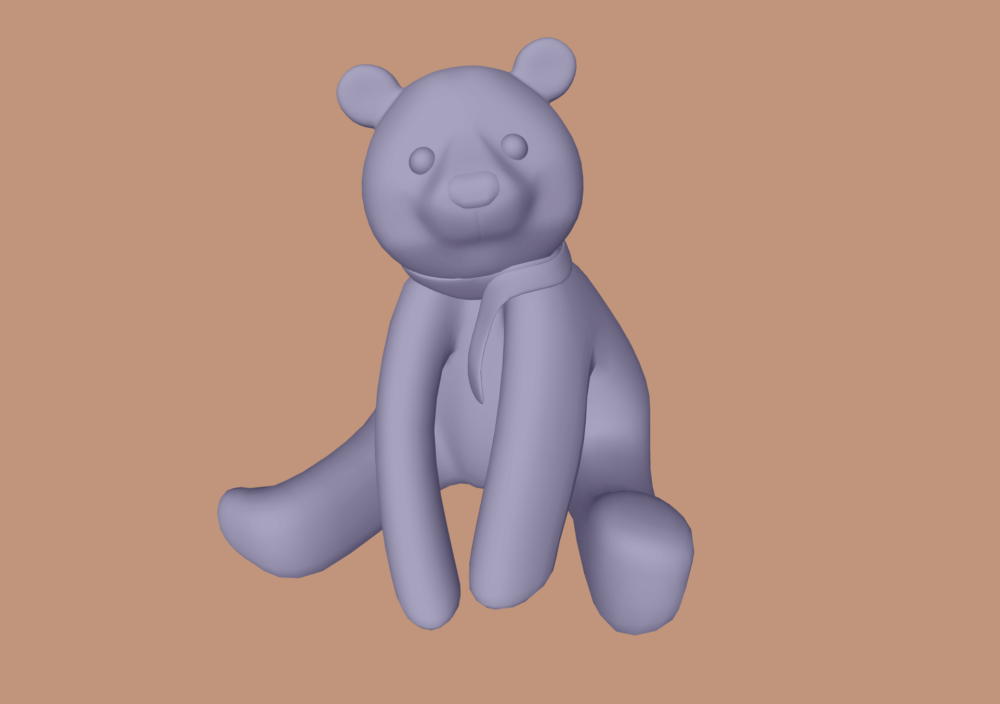

# Teddy 3D

A colorful three-dimensional teddy bear.

- Rotates to x-axis and y-axis according to mouse mouvement
- New taddy color on click
- New background color on click

## Technologies Used

&nbsp;&nbsp;&nbsp;&nbsp;&nbsp;&nbsp;

&nbsp;&nbsp;&nbsp;&nbsp;&nbsp;&nbsp;

&nbsp;&nbsp;&nbsp;&nbsp;&nbsp;&nbsp;

&nbsp;&nbsp;&nbsp;&nbsp;&nbsp;&nbsp;

## Description

- Teddy's color changes randomly on click/touch/keypress
- Background color changes randomly on click/touch/keypress
- New colors gets logged in console for reference
- Teddy can be moved by mouse/touch along with its rotation
- Created dynamically on page load, according to window dimensions
- Contained in a simple HTML page, with some essential CSS

## Screenshots

## License

Copyright (c) 2025 Michael Kolesidis 
Licensed under the [GNU General Public License v3.0](https://www.gnu.org/licenses/gpl-3.0.html).
